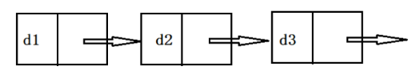
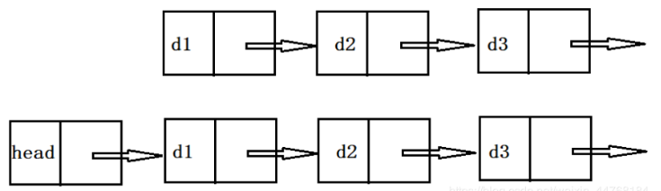
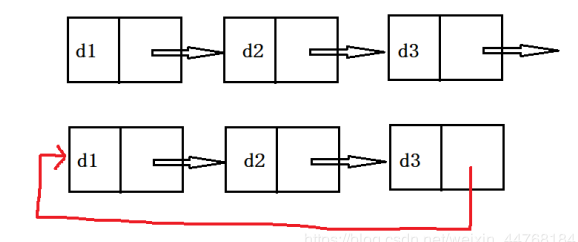

* 定义

    链表是一种用于存储数据集合的数据结构

- 属性
   - 相邻的元素之间通过指针进行链接
   - 最后一个元素的后继指针为NULL
   - 在执行的过程中链表的长度可以增加或者减少
   - 链表的空间可以按需进行分配
   - 没有存储空间的浪费，但是链表中的指针需要额外的内存开销
- 链表种类
   - 单向链表

   - 不带头单链表，带头单链表

   - 单链表，循环单链表

- Reference

    SourceCode/Moudle/SingleList

