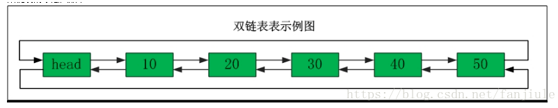
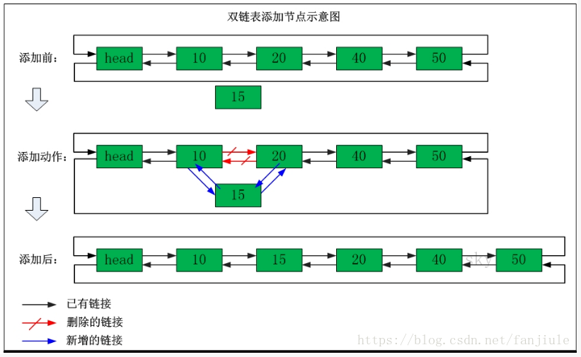
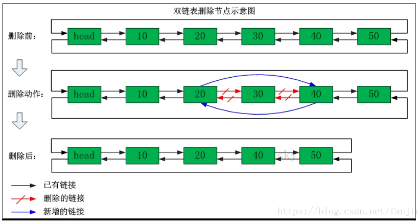

* 定义

    双向链表也叫**双链表**，是链表的一种，它的每个数据结点中都有两个指针，分别指向直接后继和直接前驱。所以，从双向链表中的任意一个结点开始，都可以很方便地访问它的前驱结点和后继结点。

- 特点

   - 插入和删除某个节点时，需要处理4个节点的指针
   - 相较于单链表，占用内存空间更大一些
   - 可以从头遍历到尾，又可以从尾遍历到头

- 双向链表示例图

- 双向链表添加节点

- 双向链表删除节点

- Reference

   SourceCode/Moudle/DoubleList

