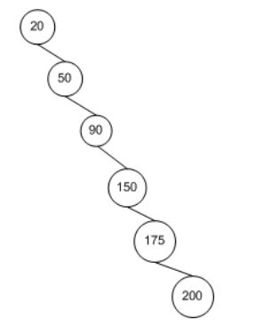

* 二叉查找树(BST:Binary Search Tree)介绍

    是一种特殊的二叉树，它改善了二叉树节点查找的效率。

- 性质
   - 若左子树不空，则左子树上所有节点的均值均小于它的根节点的值。
   - 若右子树不空，则右子树上所有节点的均值均大于它的根节点的值。
   - 左、右子树也分别为二叉排序树。
   - 没有键值相等的节点。

* 定义

    ```
     typedef struct BSTreeNode
     {
         int data;
         struct BSTreeNode *left;     //左子树
         struct BSTreeNode *right;    //右子树
     }BSTree;
    ```

* 查找节点(递归实现)

    通过BST查找节点，理想情况下需要检查的节点数可以减半。从根节点开始执行查找算法，第一次比较决定是移向左子树还是右子树，对于任意一种情况，一旦执行这一步，需要访问的接点数就减少了一半。


对于BST查找算法来说，其十分依赖于树中节点的拓扑结构，也就是节点间的布局关系，当BST树中的节点以扇形结构散开时，对它的插入、删除和查找操作最优情况下可以达到亚线性的运行时间O(log2n)。


当在BST中查找一个节点时，每一步比较操作后都会将节点的数量减少一半。但是如果拓扑结构像下图时，运行时间就会减退到线性时间O(n)，因为每一步比较操作后还是需要逐个比较其余的节点。在这种情况下，在BST中查找节点与在数组中查找就基本类似了。



因此，**BST算法查找时间依赖于树的拓扑结构。最佳情况是O(log­2n)，最坏是O(n)。**

* 插入节点

    新插入的节点一定是一个新的叶子节点。


* 删除节点

    在删除节点前，需要先找到待删除节点的位置。

* 删除叶子节点

    删除叶子节点不会破坏BST的结构。

    * 判断待删除节点的左右子树是否为空，如果为空，则表示为叶子节点。
    * 判断待删除节点是待删除节点父节点的左子树还是右子树，将对应的指针赋值为NULL。
    * 释放待删除节点。


* 删除带有一个子节点的节点

    图中有四种删除带有一个子节点的节点的可能情况，但是对于待删除节点来说，只有两种，只有左子树或只有右子树。两种情况的处理方式基本相同，都是将待删除节点的左子树、右子树赋值给待删除节点的父节点的左子树或右子树。


* 删除带两个节点的节点

    删除带有两个节点的节点会破坏BST结构风险。首先需要找到待删除节点的后继节点和该后继节点的父节点(一个节点的后继节点是指，这个节点在中序遍历序列中的下一个节点，相应的，前驱节点是指这个节点在中序遍历序列中的上一个节点),**删除节点的后继节点一定是删除节点右子树的最左侧节点**，并用后继节点替代待删除节点方式而不是前驱节点替代删除节点。


- 后继节点为待删除节点的子节点
在后继节点为待删除节点的子节点前提下，该后继节点有右子树和没有右子树操作是相同的，都是**将后继节点替代为待删除节点，并将待删除节点的左子树赋值给后继节点的左子树。**


- 后继节点不为待删除节点的子节点
   - 后继节点没有右子节点


​		删除后：


   - 后继节点有右子结点


增加一个操作，将**后继节点的右子树赋值给后继节点的父节点的左子树**

删除后：


* Reference

    https://www.cnblogs.com/lanhaicode/p/11298338.html

