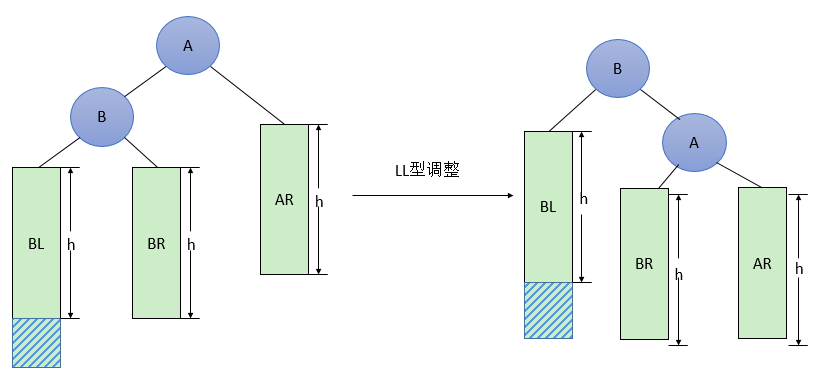
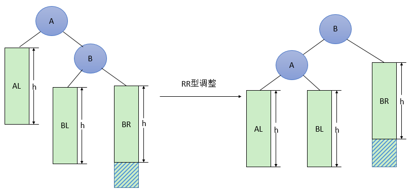
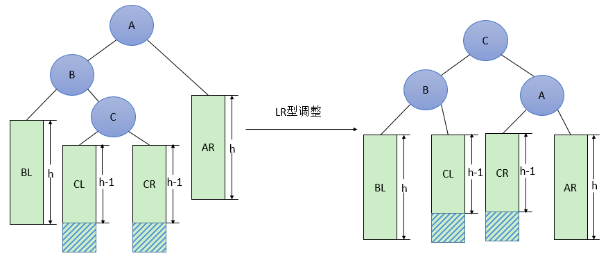
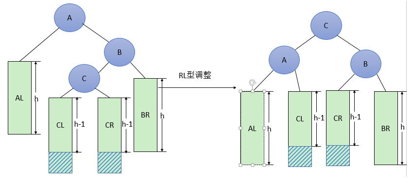

- 定义

   平衡二叉树(AVL树)，它或者是一颗空树，或者具有以下性质的二叉排序树：它的左子树和右子树的深度之差(平衡因子)的绝对值不超过1，且它的左子树和右子树都是一颗平衡二叉树。

- 平衡二叉树必要条件
   - 必须是二叉查找树。
   - 每个节点的左子树和右子树的高度差至多为1。
   
- 优点

   AVL树的查找、插入、删除操作在平均和最坏的情况下都是**O（logn）**，这得益于它时刻维护着二叉树的平衡。如果我们需要查找的集合本身没有顺序，在频繁查找的同时也经常的插入和删除，AVL树是不错的选择。

- 平衡因子

    将二叉树上节点的左子树高度减去右子树高度的值称为该节点的**平衡因子BF(Balance Factor)**。

- 最小不平衡子树

    距离插入节点最近的，且平衡因子的绝对值大于1的节点为根的子树。

* AVL树调整
    * LL型调整

        由于在A的左孩子(L)的左子树(L)上插入新结点，使原来平衡二叉树变得不平衡，此时A的平衡因子由1增至2。LL型调整的一般形式如下图所示，表示在A的左孩子B的左子树BL（不一定为空）中插入结点而导致不平衡。调整步骤为：

           * 将A的左孩子B提升为新的根结点
           * 将原来的根结点A降为B的右孩子
           * 各子树按大小关系连接(BL和AR不变，BR调整为A的左子树)

        具体如下如所示：
    
    
    
    
    
* RR型调整
    
        由于在A的右孩子(R)的右子树(R)上插入新结点，使原来平衡二叉树变得不平衡，此时A的平衡因子由-1变为-2。显然，按照大小关系，结点B应作为新的根结点，其余两个节点分别作为左右孩子节点才能平衡，A结点就好像是绕结点B逆时针旋转一样。调整步骤为：
    
       * 将A的右孩子B提升为新的根结点；
           * 将原来的根结点A降为B的左孩子
           * 各子树按大小关系连接(AL和BR不变，BL调整为A的右子树)。

        具体如下图所示：

        

        ​		
    
    * LR型调整

        由于在A的左孩子(L)的右子树(R)上插入新结点，使原来平衡二叉树变得不平衡，此时A的平衡因子由1变为2。显然，按照大小关系，结点C应作为新的根结点，其余两个节点分别作为左右孩子节点才能平衡。调整步骤为：
    
       * 将B的左孩子C提升为新的根结点；
           * 将原来的根结点A降为C的右孩子；
       * 各子树按大小关系连接(BL和AR不变，CL和CR分别调整为B的右子树和A的左子树。
    
    具体如下图：
    
        
    
    
    
    * RL型调整

        由于在A的右孩子(R)的左子树(L)上插入新结点，使原来平衡二叉树变得不平衡，此时A的平衡因子由-1变为-2。显然，按照大小关系，结点C应作为新的根结点，其余两个节点分别作为左右孩子节点才能平衡。调整步骤为：
    
           * 将B的左孩子C提升为新的根结点；
           * 将原来的根结点A降为C的左孩子；
           * 各子树按大小关系连接(AL和BR不变，CL和CR分别调整为A的右子树和B的左子树)。
    
        具体如下图：
        
        
        
        
    
* Reference

    SourceCode/Moudle/BinaryTree