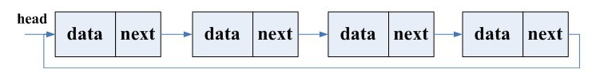

# 循环链表
循环链表是一个首尾相接的链表，将单链表的最后一个指针域由NULL改为指向表头结点这就是单链式的循环链表，并称为循环单链表

带头结点的循环单链表的各种操作的算法实现与带头结点单链表的算法实现类似，差别仅在于算法判别当前结点p是否为尾结点的条件不同。单链表中的判别条件为p!=NULL或p->next!=NULL，而单循环链表判别条件是p!=L或p->next!=L。

在循环单链表中附设尾指针有时候比附设头指针更简单。如：**在用头指针的循环单链表中找a1的时间复杂度是O(1),找an需要从头找到尾，时间复杂度是O(n),如果用为指针rear，找开始结点和终端结点的存储位置分别是rear->next->next和rear。**

