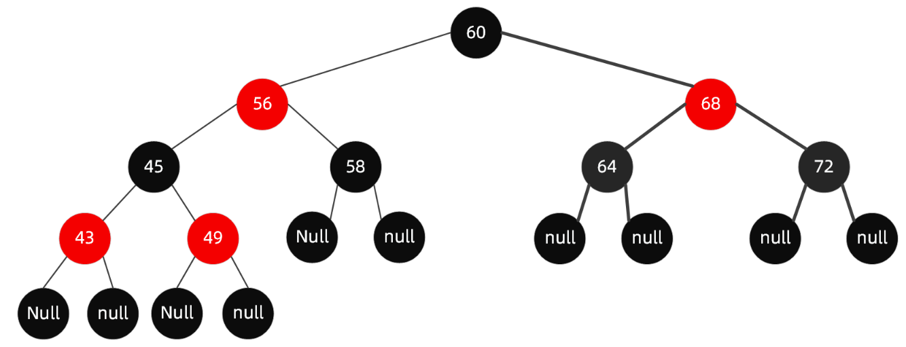

# 红黑树

## 介绍

- 特点
   - 节点分为红色或者黑色
   - 根节点必为黑色
   - 叶子节点都为黑色，且为null
   - 连接红色节点的两个子节点都为黑色（红黑树不会出现相邻的红色节点）
   - 从任意节点出发，到其每个叶子节点的路径中包含相同数量的黑色节点
   - 新加入到红黑树的节点为红色节点

## Reference
https://www.cnblogs.com/LiaHon/p/11203229.html
