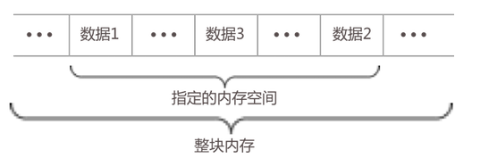
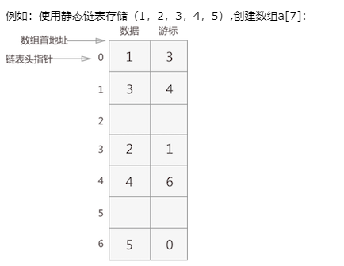
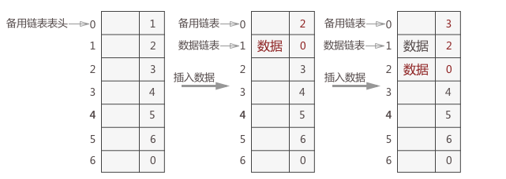

# 静态链表

- 定义：逻辑结构上相邻的数据元素，存储在指定的一块内存空间中，数据元素只允许在这块内存空间中随机存放。由于各数据元素在数组申请的内存空间内随机存放，为了体现逻辑上的相邻，为每一个数据元素配备一个具有指针作用的整形变量，用于记录下一元素在数组中的位置。
在数组申请的存储空间中，各数据元素虽随机存储，每一个元素都记录着下一元素在数组中的位置，通过前一个元素，可以找到下一个元素，构成了一条链表，这条被局限在特定内存空间的链表就是静态链表。
- 区别：静态链表限制了数据元素存放的位置范围；动态链表是整个内存空间。


- 构建方法：使用数组这一数据类型预先申请足够大的内存空间
- 节点构成
```
  typedef struct 
  {
　　  int data;//数据域
　　  int cur;//游标
  }component;
```



- 空间重复利用：由于静态链表提前申请了有限的内存空间，在使用的过程中，极有可能会出现申请的内存空间不足，需要使用之前被遗弃的内存空间。被遗弃的意思是：之前已经使用，但是后期对该结点做了摘除操作，该内存空间中存放的是已经不用的垃圾数据。
所以，在整个过程中，需要自己动手把两者区分开，也就是需要自己实现 malloc 和 free 两个函数的作用。解决的办法是：提前将所有未被使用的结点链成一个备用链表。需要对链表做插入操作时，从备用链表上摘下一个结点使用；删除链表中的结点时，删除的同时链接到备用链表上，以备下次使用。



- 基本操作：初始化链表、查找数据、更改数据、插入结点、删除操作

## 参考
https://www.cnblogs.com/ciyeer/p/9027973.html
