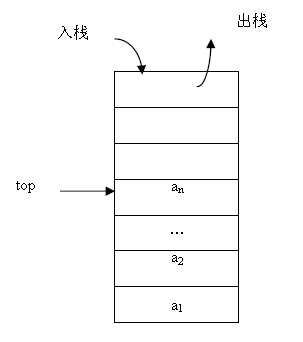

# 顺序栈
- 定义：用一段连续的存储空间来存储栈中的数据元素，比较常见的是用数组来实现顺序栈。
- 存储结构：
   - 元素所占的存储空间必须连续（这里的连续是指的逻辑连续，而不是物理连续）
   - 元素在存储空间的位置是按逻辑顺序存放的
   

- 基本操作：初始化栈、入栈、遍历栈、出栈、判断栈是否为空、判断栈是否为满

## 参考
参考代码：

https://github.com/ccldmf/C-A-A/tree/master/SourceCode/Moudle/OrderStack

https://www.cnblogs.com/lanhaicode/p/10453602.html
